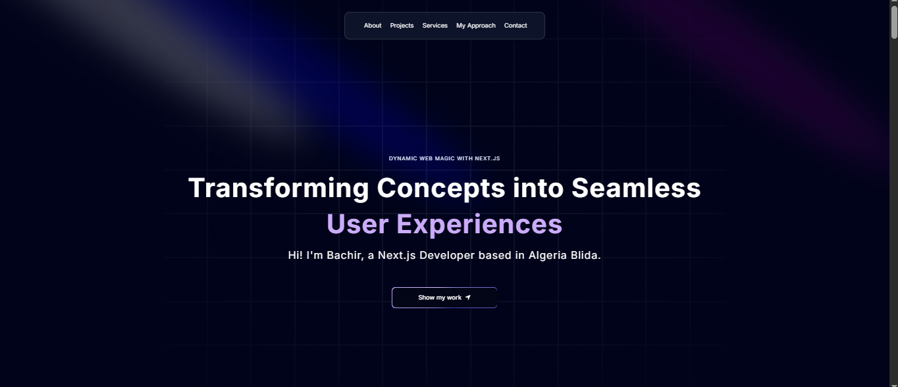
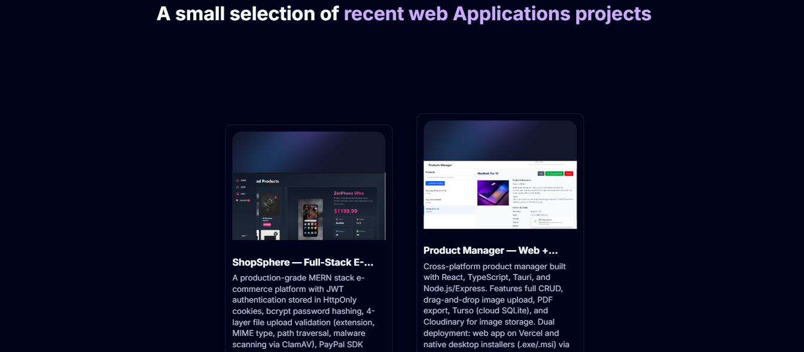
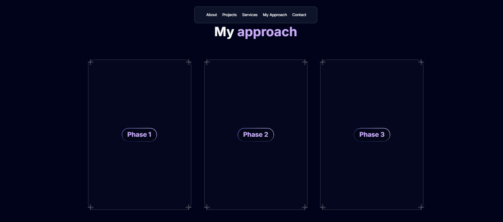

# 🌐 Tidjani Bachir — Personal Portfolio Website

> A modern, fully responsive personal portfolio built with **Next.js 14**, **TypeScript**, **Tailwind CSS**, and **Framer Motion** — featuring multilingual support (English, Arabic, French), 3D animations, parallax effects, and a complete showcase of projects, skills, and approach.

> 🚀 **Live Demo:** [personnel-website-dusky.vercel.app](https://personnel-website-dusky.vercel.app)

---

## 📸 Screenshots

| Hero Section | Projects | My Approach |
|---|---|---|
|  |  |  |

---

## ✨ Features

- 🌍 **Multilingual** — Full support for English, Arabic (RTL), and French
- 🎬 **Framer Motion Animations** — Smooth scroll-driven parallax, spring physics, and entrance animations
- 🌐 **3D Globe** — Interactive Three.js globe via `@react-three/fiber` and `three-globe`
- 📜 **Hero Parallax** — Scroll-animated product showcase with 3 rows of UI design thumbnails
- 🃏 **Bento Grid** — Responsive grid layout showcasing skills and values
- 💼 **Projects Section** — 4 real deployed projects with live links and tech tags
- 🛠️ **My Approach** — 4-phase development philosophy section
- 🎨 **Dark / Light Mode** — Theme switching via `next-themes`
- 💬 **Testimonials** — Animated testimonial cards
- 📱 **Fully Responsive** — Mobile-first design across all screen sizes
- ✉️ **Contact Section** — Direct contact with copy-to-clipboard email

---

## 🛠️ Tech Stack

| Technology | Purpose |
|---|---|
| [Next.js 14](https://nextjs.org/) | React framework with App Router |
| [TypeScript 5](https://www.typescriptlang.org/) | Type-safe development |
| [Tailwind CSS 3](https://tailwindcss.com/) | Utility-first styling |
| [Framer Motion](https://www.framer.com/motion/) | Animations and scroll-driven effects |
| [@react-three/fiber](https://docs.pmnd.rs/react-three-fiber) | 3D rendering with Three.js |
| [@react-three/drei](https://github.com/pmndrs/drei) | Three.js helpers |
| [three-globe](https://github.com/vasturiano/three-globe) | Interactive 3D globe |
| [react-lottie](https://github.com/chenqingspring/react-lottie) | Lottie animation support |
| [next-themes](https://github.com/pacocoursey/next-themes) | Dark/light theme management |
| [tailwind-merge](https://github.com/dcastil/tailwind-merge) | Tailwind class merging utility |
| [tailwindcss-animate](https://github.com/jamiebuilds/tailwindcss-animate) | CSS animation utilities |
| [@tabler/icons-react](https://tabler.io/icons) | Icon library |
| [react-icons](https://react-icons.github.io/) | Additional icon sets |

---

## 📁 Project Structure

```
├── app/
│   ├── globals.css          # Global styles
│   ├── layout.tsx           # Root layout with theme provider
│   └── page.tsx             # Main page — renders all sections
├── components/
│   ├── ui/                  # Reusable UI components
│   │   ├── hero-parallax.tsx    # Scroll parallax product showcase
│   │   ├── bento-grid.tsx       # Bento grid layout
│   │   ├── moving-border.tsx    # Animated border component
│   │   ├── infinite-moving-cards.tsx  # Testimonials slider
│   │   └── ...
│   ├── Hero.tsx             # Landing hero section
│   ├── Grid.tsx             # Bento grid section
│   ├── Projects.tsx         # Projects showcase
│   ├── PresentMain.tsx      # Hero parallax wrapper
│   ├── Approach.tsx         # My approach section
│   ├── Footer.tsx           # Footer with social links
│   └── ...
├── data/
│   └── index.ts             # All static data (projects, nav, grid, approach)
├── hooks/                   # Custom React hooks
├── lib/                     # Utility functions
├── utils/                   # Helper utilities
└── public/                  # Static assets and screenshots
```

---

## 📊 Sections

| Section | Description |
|---|---|
| **Hero** | Full-screen landing with animated headline and CTA |
| **Bento Grid** | Responsive grid showcasing values, tech stack, and collaboration style |
| **Hero Parallax** | Scroll-driven 3-row parallax showcase of UI designs |
| **Projects** | 4 real deployed projects with live links and tech tags |
| **Testimonials** | Infinite scrolling testimonial cards |
| **My Approach** | 4-phase development philosophy (UML → Collaborate → Test → Deploy) |
| **Contact** | Footer with GitHub, LinkedIn, and email |

---

## 🗂️ Data Structure

All content is centralized in `data/index.ts` for easy updates:

```typescript
// Navigation (3 languages):
export const navItems = [...]
export const navItemsArabic = [...]
export const navItemsFrench = [...]

// Bento grid (3 languages):
export const gridItems = [...]
export const gridItemsArabic = [...]
export const gridItemsFrench = [...]

// Real projects:
export const projects = [...]      // 4 deployed projects

// Parallax showcase:
export const products2 = [...]     // UI design thumbnails

// Services section:
export const workExperience = [...]  // 3 service types

// Approach section:
export const approach = [...]       // 4 development phases

// Testimonials:
export const testimonials = [...]

// Social media:
export const socialMedia = [...]
```

---

## 🚀 Getting Started

### Prerequisites

- Node.js ≥ 18
- npm or yarn
- **Important:** Do NOT place this project inside OneDrive, Google Drive, or Dropbox — npm will fail with EPERM errors

### Installation

```bash
# Clone the repository
git clone https://github.com/Tidjani1Bachir/personnelWebsite.git
cd personnelWebsite

# Install dependencies (legacy flag needed for react-lottie compatibility)
npm install --legacy-peer-deps

# Start development server
npm run dev
```

Open [http://localhost:3000](http://localhost:3000) in your browser.

### Build for Production

```bash
npm run build
npm run start
```

---

## ☁️ Deployment

This project is deployed on **Vercel**:

1. Push your repo to GitHub
2. Import at [vercel.com](https://vercel.com)
3. Vercel auto-detects Next.js — no extra config needed
4. Click **Deploy** ✅

---

## 🌍 Multilingual Support

The portfolio supports 3 languages with separate data arrays for each:

```typescript
// Switch language by using the matching data array:
import { navItems, navItemsArabic, navItemsFrench } from "@/data"
import { gridItems, gridItemsArabic, gridItemsFrench } from "@/data"
```

Arabic content uses RTL layout handled via Tailwind's `dir` utilities.

---

## 📦 Key Dependencies

```json
"next":              "14.2.4",
"react":             "^18",
"typescript":        "^5",
"framer-motion":     "^11.2.13",
"@react-three/fiber":"^8.16.8",
"@react-three/drei": "^9.108.3",
"three-globe":       "^2.31.1",
"next-themes":       "^0.3.0",
"tailwindcss":       "^3.4.1",
"react-lottie":      "^1.2.4"
```

> **Note:** Use `npm install --legacy-peer-deps` due to `react-lottie` requiring an older npm engine version.

---

## 📝 License

This project is open source and available under the [MIT License](LICENSE).

---

<p align="center">
  Built with ❤️ by <a href="https://github.com/Tidjani1Bachir">Tidjani Bachir</a>
  <br/>
  <sub>Full-Stack Developer — Blida, Algeria</sub>
</p>
